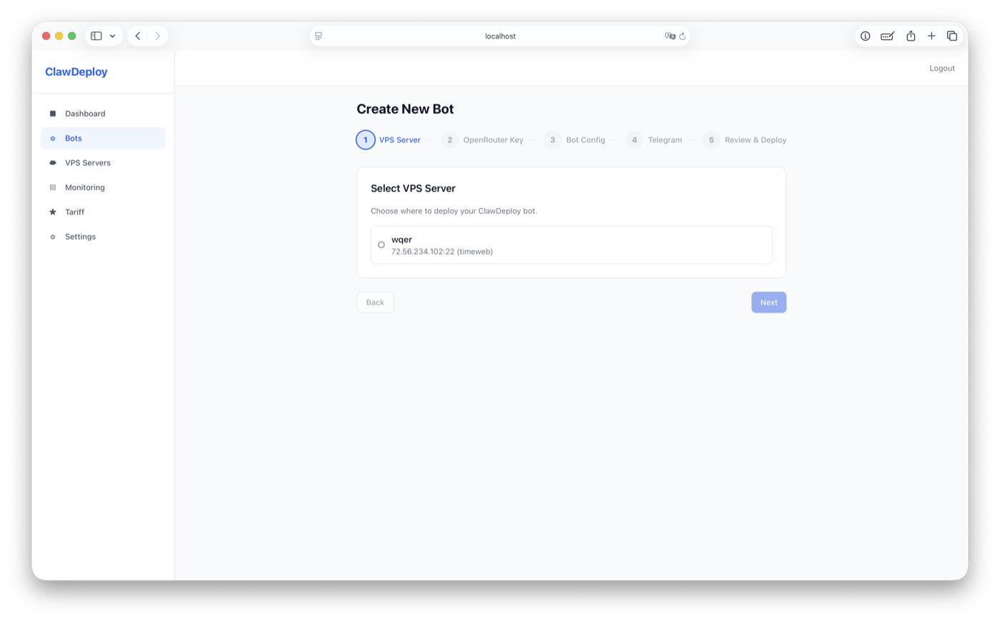

# ClawDeploy

Open-source platform for deploying and managing AI bots powered by [ZeroClaw](https://github.com/zeroclaw-labs/zeroclaw) and [OpenRouter](https://openrouter.ai).

Deploy Telegram bots with any LLM model (Claude, GPT, DeepSeek, Llama, etc.) to your own VPS servers. Manage everything from a web dashboard.



## Pricing

**Self-hosted (free forever):**
- Bring your own VPS servers
- Bring your own OpenRouter API key
- Unlimited bots, no restrictions
- Full source code, MIT license

**Managed (coming soon):**
- We provide VPS servers and API tokens
- Pay only for what you use
- No setup required

## Features

- **Bot Management** — Create, configure, deploy, start/stop bots from a web UI
- **VPS Deployment** — Connect any VPS via SSH, auto-installs Docker if needed
- **OpenRouter Integration** — Access 200+ LLM models with a single API key
- **Telegram Bots** — Deploy AI assistants to Telegram with allowed user lists
- **Model Fallbacks** — Auto-switch to a cheaper model if the primary is unavailable
- **Usage Tracking** — Monitor token usage and costs per bot
- **Encryption** — SSH credentials and API keys encrypted with AES-256-GCM
- **Force Delete** — Clean removal of bots from VPS with Docker cleanup

## Tech Stack

| Layer     | Technology                          |
|-----------|-------------------------------------|
| Frontend  | Vue 3, Vite, TailwindCSS           |
| Backend   | Fastify, Drizzle ORM, TypeScript   |
| Database  | PostgreSQL 16                       |
| Auth      | JWT (access + refresh tokens)       |
| Monorepo  | pnpm workspaces, Turborepo         |
| Deploy    | Docker, Docker Compose              |

## Quick Start

### 1. Clone and generate secrets

```bash
git clone https://github.com/ariran5/clawdeploy.git
cd clawdeploy
chmod +x scripts/generate-env.sh
./scripts/generate-env.sh
```

### 2. Start with Docker

```bash
docker compose up --build
```

Open [http://localhost:3480](http://localhost:3480), register an account, and start creating bots.

### 3. Create your first bot

1. **Add VPS** — Go to VPS page, add your server (IP, SSH credentials)
2. **Create Bot** — Go through the wizard: name, model, Telegram token
3. **Deploy** — Hit deploy, ClawDeploy connects to your VPS and starts the bot

## Using Pre-built Images

```bash
docker pull ghcr.io/ariran5/clawdeploy/api:latest
docker pull ghcr.io/ariran5/clawdeploy/web:latest
```

## Development

### Prerequisites

- Node.js 22+
- pnpm 9+
- PostgreSQL 16 (or use Docker)

### Local setup

```bash
# Install dependencies
pnpm install

# Start dev database
docker compose -f docker-compose.dev.yml up -d

# Generate .env for local dev
DB_HOST=localhost ./scripts/generate-env.sh

# Run dev servers (API + Web)
pnpm dev
```

API: `http://localhost:3000` | Web: `http://localhost:5173`

## Project Structure

```
clawdeploy/
  apps/
    api/          # Fastify backend
    web/          # Vue 3 frontend
  packages/
    shared/       # Shared types & validation (Zod)
  scripts/
    generate-env.sh
  docker-compose.yml
  docker-compose.dev.yml
```

## API Endpoints

| Method | Path                         | Description              |
|--------|------------------------------|--------------------------|
| POST   | /api/auth/register           | Register                 |
| POST   | /api/auth/login              | Login                    |
| POST   | /api/auth/refresh            | Refresh JWT              |
| GET    | /api/bots                    | List bots                |
| POST   | /api/bots                    | Create bot               |
| GET    | /api/bots/:id                | Get bot                  |
| PATCH  | /api/bots/:id                | Update bot               |
| DELETE | /api/bots/:id                | Delete bot (+ VPS cleanup) |
| DELETE | /api/bots/:id?force=true     | Force delete (skip VPS)  |
| PUT    | /api/bots/:id/config         | Set bot config           |
| POST   | /api/bots/:id/deploy         | Deploy to VPS            |
| POST   | /api/bots/:id/start          | Start bot                |
| POST   | /api/bots/:id/stop           | Stop bot                 |
| POST   | /api/bots/:id/restart        | Restart bot              |
| GET    | /api/bots/:id/logs           | Get bot logs from VPS    |
| GET    | /api/vps                     | List VPS servers         |
| POST   | /api/vps                     | Add VPS server           |
| POST   | /api/vps/:id/test            | Test SSH connection      |
| PUT    | /api/telegram/bots/:botId    | Set Telegram token       |
| GET    | /api/openrouter/models       | List available models    |

## Environment Variables

See [.env.example](.env.example) for the full list with comments.

| Variable           | Description                     | Required |
|--------------------|---------------------------------|----------|
| DATABASE_URL       | PostgreSQL connection string    | Yes      |
| JWT_ACCESS_SECRET  | JWT signing key (min 32 chars)  | Yes      |
| JWT_REFRESH_SECRET | JWT refresh signing key         | Yes      |
| ENCRYPTION_KEY     | AES-256 key (64 hex chars)      | Yes      |
| DB_PASSWORD        | PostgreSQL password             | Yes      |

## How It Works

```
User -> Web UI (Vue) -> API (Fastify) -> SSH -> VPS
                                      -> PostgreSQL
                                      -> OpenRouter API
```

1. User configures a bot (model, API key, Telegram token)
2. API generates a ZeroClaw `config.toml`
3. API connects to VPS via SSH, installs Docker if needed
4. Uploads config + docker-compose.yml
5. Runs `docker compose up -d` on the VPS
6. ZeroClaw container starts and connects to Telegram

## License

[MIT](LICENSE)
